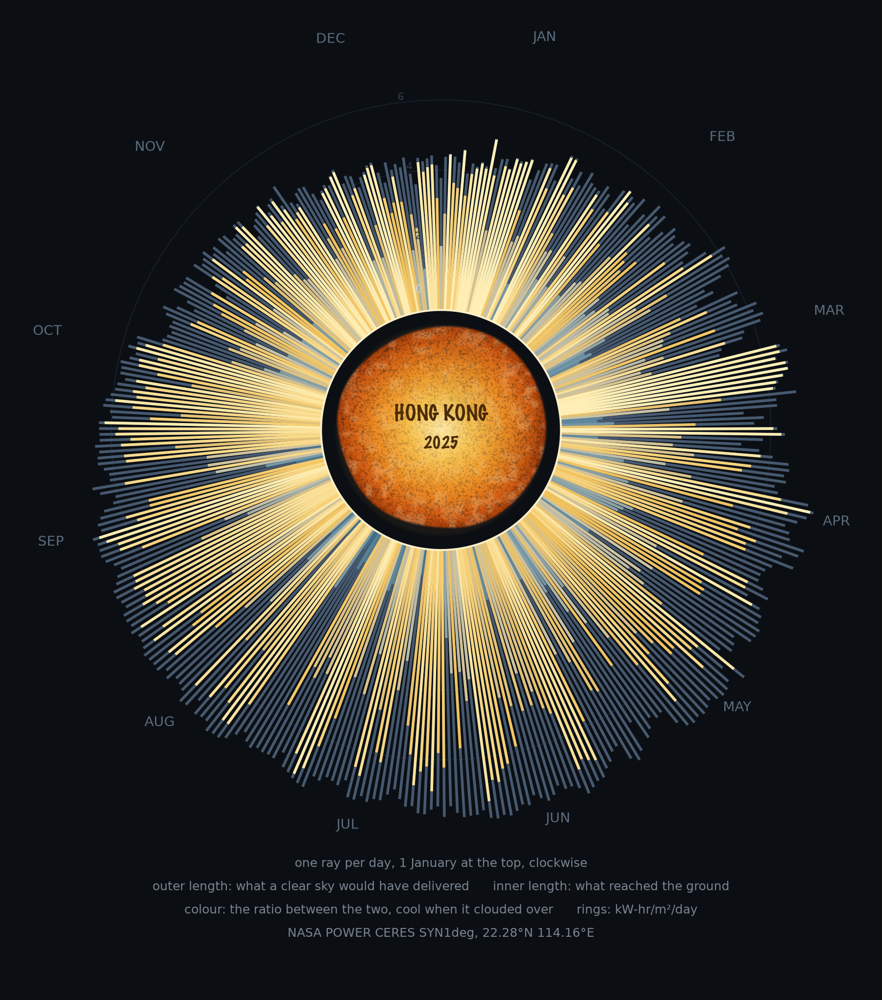

# A year of sunlight over Hong Kong



## The phenomenon

The sun does not deliver the same thing every day. At 22°N the height of the sun
at noon swings between roughly 45° in December and 90° in June, so a clear June
day offers nearly twice the energy of a clear December one. On top of that comes
the cloud: Hong Kong's sky is generous in winter and stingy in spring, and no
season's ceiling is ever fully delivered. 2025 is a year of both, one number per
day, 365 numbers.

## The data

NASA POWER, CERES SYN1deg, for the point 22.28°N 114.16°E — the file is
`data/nasa-power-hong-kong-daily-solar-2025.csv`, fetched once from the API and
committed unchanged:

<https://power.larc.nasa.gov/api/temporal/daily/point>

365 rows after the header block, one per day of 2025. A row is
`YEAR,MO,DY,ALLSKY_SFC_SW_DWN,CLRSKY_SFC_SW_DWN`, both columns in kW-hr per square
metre per day: what actually reached the ground, and what a cloudless sky would
have delivered to it.

## The picture

Every day of the year is one ray leaving the centre of the page. 1 January is at
the top and the year runs clockwise, so the wheel is a calendar. The pale line is
the clear-sky ceiling of that day; the coloured line over it is what got through;
the colour of that line is the ratio between the two. Winter rays are short
because the ceiling itself is low; summer rays reach far out. A dull day is a
short bright stub inside a long pale promise, which is what much of February to
May looks like: 4 April received 3.44 kW-hr/m² against a ceiling of 5.78.

In the middle is a sun, amber at the centre through to burnt orange at the rim,
pressed on coarse paper rather than filled flat: the rim wanders, the tooth of
the sheet keeps part of the ink off the page, and the lettering on it is written
by hand rather than set in type. Just outside it runs the thin pale ring that is
zero: it sits at the radius every ray starts from, so a length on the page can be
read and not only compared. The sun is deliberately smaller than the hole it sits
in and never touches a ray. It is the one mark on the page that is not data, and
it is not allowed to measure anything.

## What it shows, and what it hides

It shows the two things at once and refuses to separate them — the season sets
the length, the cloud decides the colour. January is the clearest month (84.9% of
its ceiling); August is the dullest (63.9%), followed by May (64.2%). The dullest
single day in the year was 4 August, when 6.5% of the available light arrived; the
clearest was 23 March, at 99.8%.

What it hides: one number per day cannot say *when* the sun came out. A day of
clear mornings and rainy afternoons and a uniformly grey day that happen to
deliver the same total are drawn identically. It also hides the space inside the
cell: the value is an average over a 0.5° × 0.625° box, so nothing distinguishes
a sunny island from a cloudy hill. And it is one year — a month here is one
month, not a climate.

## The same year, one control at a time

The printed picture asks you to trust it. There is a second version of the same
wheel at <https://ardenshi.github.io/hong-kong-sunlight/>, drawn as SVG from the
same 365 numbers and built as a small interface, in the shape week 4 asks for —
one control, one clear response.

> When I choose a month, the wheel keeps that month's rays lit and the line below
> the control reports what that month got.

| Part | In this page |
|---|---|
| Input | The month selector; the day selector inside it |
| State | The chosen month and day, held in two variables and shown in the controls |
| Response | The wheel: the other months fade, the chosen one stays lit, its label brightens, and the line below changes |
| Data | One request for `site/sunlight-2025.json` — the browser receives 365 records, never a finished picture |

What crossed the network is records, not a chart: `[month, day, what reached the
ground, what a cloudless sky would have offered]` for every day of 2025, and the
rays are drawn from them in the browser. The link under the picture opens that
request. Reading a day is still there as before — pointing at a ray dims the other
364 and shows its three numbers — and clicking one writes that day into the two
selectors, so the state is always visible somewhere other than the thing you
pointed at.

Two rules the page keeps from the printed version. The scale is fixed before
anything is chosen, so choosing a month changes what is lit and never what a
length means; it is 8 kW-hr/m²/day at the rim in the print and in every year of
the page, so a ray can be carried from one to the other. And the centre is the
same sun on the same coarse paper, with the same zero ring, so the versions read
as one drawing. Like the picture, the page is generated rather than
hand-written, by `site.py`.

The selectors also make the page usable where there is no pointer to hover with,
which is most phones.

## The year that has not finished

Beside the title there is a way into 2026, which is a year still being written.
That page is the same wheel, the same control and the same response, drawn from
`site/sunlight-2026.json`; it simply stops where the published days stop, and
the gap between the last ray and the top of the wheel is the rest of the year
still to come. A daily workflow —
`.github/workflows/update-2026.yml`, which runs `update.py` and then `site.py` —
asks NASA POWER again every morning and commits the new day, so the page grows by
itself. 2025 is not touched by it: that year is over, it was fetched once, and it
goes on working with the network switched off.

The line under the 2026 wheel says how far the year has got. On 24 September 2026
it reads: 262 of 365 days published, up to Saturday, 19 September.

A year that is still arriving also shows something a finished year cannot. POWER
sometimes publishes what reached the ground before it publishes the clear-sky
ceiling of the same day, so some of 2026's days have one number and not the two
the drawing is built from. Those days are still drawn, in grey, at the length of
what actually arrived, with no pale promise beyond them and no ratio to colour
them by, and the legend says so. Dropping them would have thrown away real
measurements; colouring them would have invented a ceiling. On 24 September this
was 76 of the 262 days, all of them since the end of June.

## How to run it

```bash
uv run peek.py     # read the file and print it, before drawing anything
uv run plot.py     # writes out/sunlight-2025.png
uv run site.py     # writes a page and its records for every year in data/
uv run fetch.py    # only if data/ is missing: asks NASA once for 2025
uv run update.py   # asks NASA again for the year that is still happening

# the page needs an http address; a file:// page may not fetch its own data
cd site && uv run python -m http.server 8000     # then open 127.0.0.1:8000

# the small tests, on the reading of the file rather than the drawing of it
uv run --with pytest python -m pytest tests/test_site.py
```
